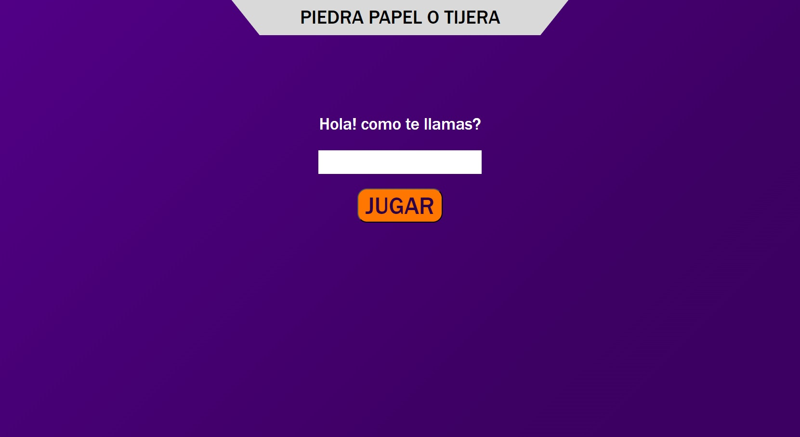
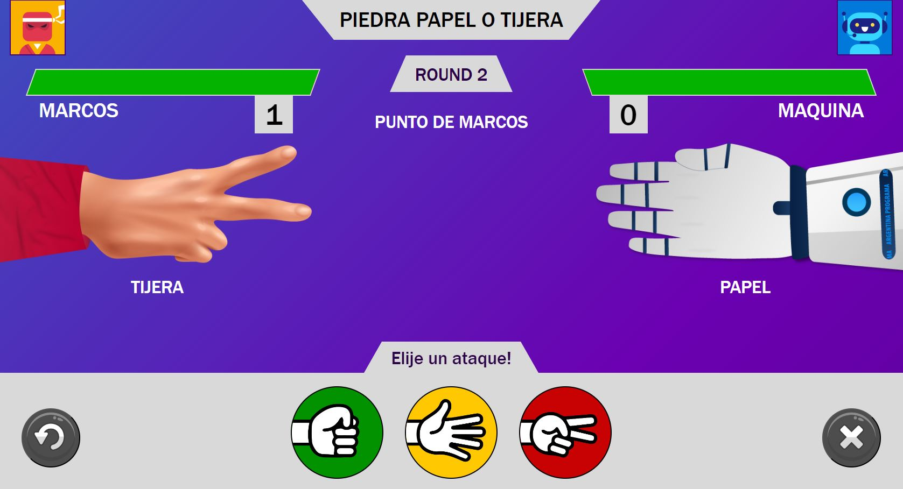
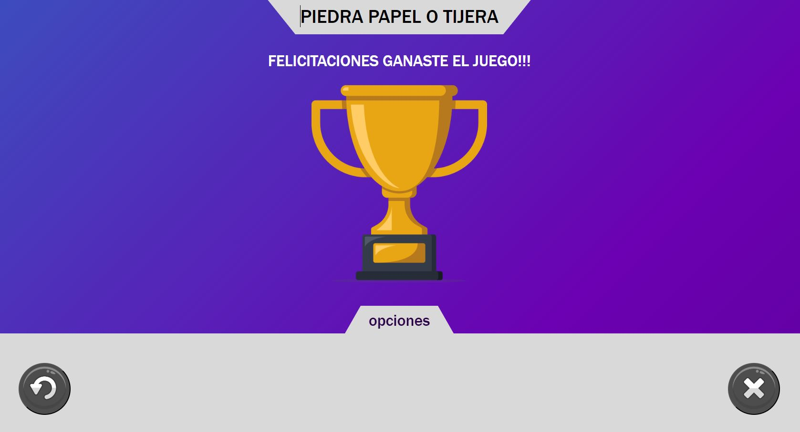

# Piedra, Papel o Tijera con REACT 🗿📄✂️

¡Bienvenido/a al juego de Piedra, Papel o Tijera creado con REACT! Este es un juego simple pero entretenido en el que compites contra la máquina en una serie de rondas. Fue desarrollado como parte del Trabajo Práctico Nº3 de la formación en "Argentina Programa 4.0" dictado en 2023 por la FAMAF - UNC. | 👨‍🎓 **ALUMNO: Marcos Mingo**.
A continuación, se describe cómo funciona el juego, como ejecutarlo y los elementos que lo componen.

## Capturas de Pantalla 📸

## Cómo Jugar 🎮
1. Al iniciar el juego, se te pedirá que ingreses tu nombre.
2. Una vez que ingreses tu nombre y hagas clic en "Jugar", podrás elegir entre las opciones de "Piedra", "Papel" o "Tijera" haciendo clic en los botones correspondientes.
3. Después de hacer tu elección, la máquina también hará su elección de forma aleatoria.
4. Se determinará el resultado de la ronda y se actualizarán los puntos.
5. El juego continúa hasta que un jugador alcance 3 puntos, momento en el que se anunciará al ganador.

## Elementos del Juego 🕹️
* Botón "Jugar": Inicia el juego y registra el nombre del usuario.
* Avatar de Usuario y Máquina: Representan a los jugadores. 👤🤖
* Display: Muestra mensajes y resultados del juego.
* Botón "Reiniciar": Reinicia el juego. 🔄
* Botón "Salir": Cierra el juego. ❌
* Puntos de Usuario y Máquina: Muestran los puntos acumulados. 0️⃣-1️⃣
* Barras de Vida: Indican la vida que le queda a cada jugador. (aun no implementada)
* Round: Muestra el número de ronda.

## Cómo Ejecutar el Juego ▶️
1. **Navegar a:** https://marcosmin.github.io/practico3/ 🌐
2. **Registro de usuario:** Ingresa tu nombre y haz clic en "Jugar".
3. **Manejo de Errores:** Si el campo está vacío, se mostrará un mensaje de error y no podrás avanzar hasta ingresar tu nombre.
4. **Jugada:** Elige tu jugada haciendo clic en "Piedra", "Papel" o "Tijera". 🗿📄✂️
5. **Reiniciar:** Observa el resultado de la ronda y decide si deseas seguir jugando o reiniciar el juego para comenzar una nueva partida.
6. **Salir:** Si deseas salir del juego, puedes hacerlo utilizando el botón "Salir". ❌

## Licencia 💚

**Este proyecto es de Libre Uso.** Puedes utilizar, modificar y distribuir el código de este proyecto de acuerdo a tus necesidades.

---
Hecho con ❤️ por [Marcos Mingo](https://github.com/marcosmin) 😊